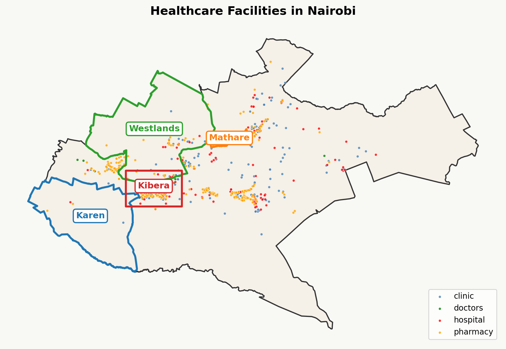
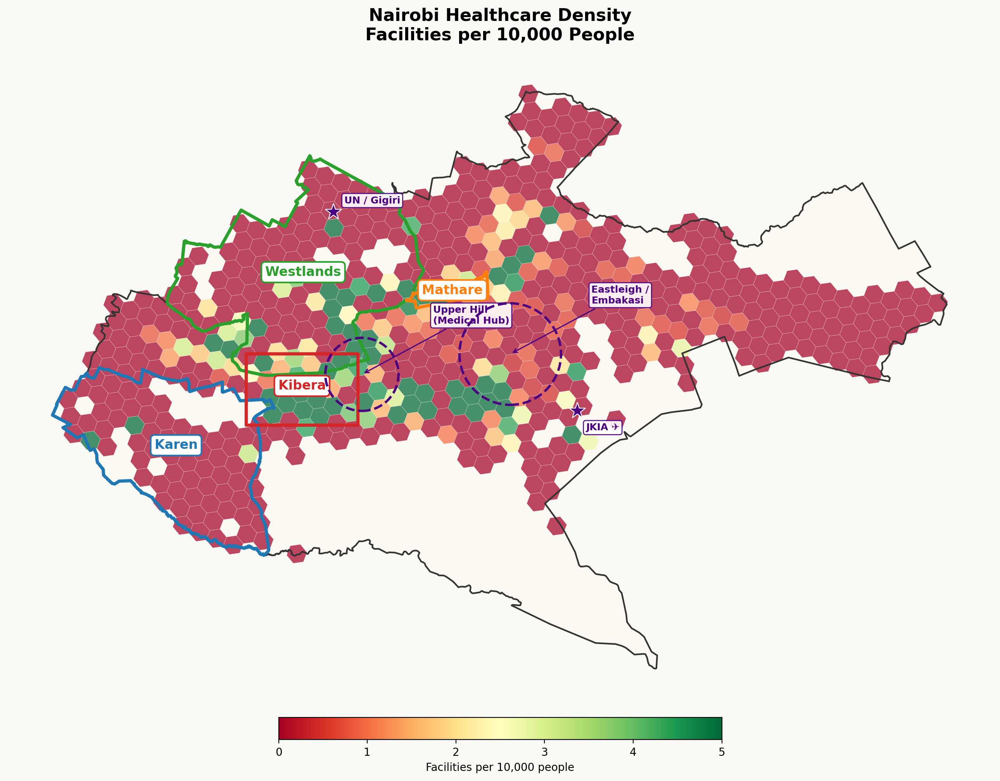
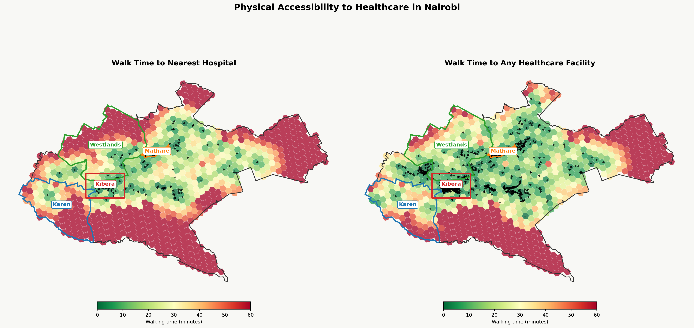
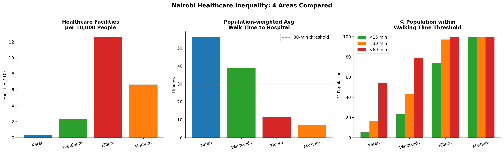

# Nairobi Healthcare Accessibility — GIS Analysis

**Research Question:** How does healthcare accessibility differ between wealthy neighbourhoods (Karen, Westlands) and informal settlements (Kibera, Mathare) in Nairobi?

**Deliverables:** Jupyter notebook exported as HTML + 6-slide executive summary presentation

---

## Study Areas

| Area | Type | Population (WorldPop 2020) |
|------|------|---------------------------|
| Karen | Wealthy residential (low-density) | ~102,000 |
| Westlands | Wealthy / commercial | ~325,000 |
| Kibera | Informal settlement | ~222,000 |
| Mathare | Informal settlement | ~194,000 |

---

## Data Sources

| Dataset | Source | Local path |
|---------|--------|------------|
| Kenya OSM POI (hospitals, clinics, pharmacies) | [Geofabrik Kenya](https://download.geofabrik.de/africa/kenya.html) | `Data/raw/kenya-260510-free/gis_osm_pois_free_1.shp` |
| WorldPop Kenya 2020 constrained 100m raster | [WorldPop Hub](https://hub.worldpop.org/geodata/summary?id=49694) | `Data/raw/ken_pop_2020_CN_100m_R2025A_v1.tif` |
| Nairobi walk network (auto-downloaded) | OSMnx / OpenStreetMap | `Data/processed/nairobi_walk.graphml` (83 MB, not in git) |
| Kibra (Kibera) boundary | OpenStreetMap relation [#16246699](https://www.openstreetmap.org/relation/16246699) | auto-fetched via `ox.geocode_to_gdf("Kibra, Nairobi, Kenya")` |

> Raw data files are **not committed** due to size. Download them manually — see paths above.

---

## Project Structure

```
Project/
├── Data/
│   ├── raw/                                        # Downloaded source data (not versioned)
│   │   ├── kenya-260510-free/gis_osm_pois_free_1.shp
│   │   └── ken_pop_2020_CN_100m_R2025A_v1.tif
│   └── processed/                                  # Walk graph (auto-generated, not versioned)
├── notebooks/
│   └── nairobi_healthcare.ipynb                    # Main analysis notebook
├── outputs/
│   ├── figures/                                    # Generated maps (versioned)
│   └── tables/
│       └── area_summary.csv                        # Per-area statistics
├── nairobi_healthcare.html                         # Exported notebook (full analysis, self-contained)
├── requirements.txt
└── README.md
```

---

## Analysis Workflow

### Step 1 — Data Loading & Spatial Filtering
Load Nairobi boundary via OSMnx geocode. Load Kenya OSM POI shapefile, filter to health types (`hospital`, `clinic`, `pharmacy`, `doctors`), clip to Nairobi → **980 facilities**.

### Step 2 — H3 Hexagonal Grid (resolution 9, ~0.105 km²/hex)
Fill Nairobi polygon with H3 hexagons. Count facilities per hexagon. Extract WorldPop population via zonal statistics.

### Step 3 — Facility Density Map
Choropleth of facilities per 10,000 people. Population threshold >500 applied to filter low-density/peri-urban noise. Colormap capped at 5/10k for contrast.

### Step 4 — Walking Network & Multi-source Dijkstra
Download Nairobi walk graph via OSMnx (72,265 nodes, 176,850 edges). Super-source Dijkstra: virtual node connected to all facility nodes at cost 0, then single-source shortest path gives travel time from every node to nearest facility in one pass.

### Step 5 — Walk-Time Maps
Side-by-side choropleths: walk time to nearest hospital vs any facility.

### Step 6 — Per-Area Comparison
Population-weighted statistics per study area, bar charts.

---

## Results

### Map 1 — Facility Overview



980 health facilities in Nairobi. Hospitals concentrated in city centre (Upper Hill medical hub). Kibera and Mathare have high clinic/pharmacy density driven by NGO provision.

---

### Map 2 — Facilities per 10,000 People



Key annotations:
- **Upper Hill (Medical Hub):** highest facility concentration in the city
- **Eastleigh / Embakasi:** elevated per-capita values likely reflect WorldPop underestimation of daytime workers near JKIA, not genuine residential accessibility
- **UN / Gigiri:** international zone, low mapped facility count

---

### Map 3 — Walk-Time Accessibility



City centre is highly accessible on foot (dark green). Karen (southwest) and eastern periphery show >60-minute walk times (dark red).

---

### Map 4 — Area Comparison Charts



---

### Summary Table

| Area | Area km² | Population | All Facilities | Hospitals | Facilities / 10k | Avg Walk to Hospital | % <15 min | % <30 min | % <60 min |
|------|---------|-----------|--------------|---------|----------------|---------------------|----------|----------|----------|
| **Karen** | 71.3 | 101,925 | 4 | 1 | 0.39 | **55.7 min** | 3.8% | 18.9% | 55.2% |
| **Westlands** | 97.5 | 324,665 | 75 | 12 | 2.31 | 38.3 min | 24.8% | 45.7% | 78.3% |
| **Kibera** | 23.7 | 222,286 | 281 | 38 | 12.64 | 10.6 min | 75.2% | 96.1% | 100.0% |
| **Mathare** | 3.0 | 193,786 | 129 | 18 | 6.66 | **6.2 min** | 99.1% | 100.0% | 100.0% |

---

## Key Findings

1. **Karen (wealthy, low-density) has the worst walking accessibility** — average 55.7 min to hospital, only 3.8% within 15 min. Reflects car dependency; residents drive to Upper Hill.
2. **Kibera and Mathare show surprisingly high facility counts** — driven by NGO/aid clinic provision and OSM coverage. Walk times are short partly because the areas are compact and dense.
3. **Westlands is moderate on both metrics** — urban wealthy area with reasonable walk access.
4. **Walking accessibility ≠ quality of care** — informal settlements have quantity but not necessarily specialist/high-quality services.

---

## Limitations

- OSM may underrepresent informal healthcare providers in Kibera/Mathare (actual counts likely higher)
- WorldPop likely underestimates population in dense informal settlements (tin-roof high-density structures)
- Walk-time assumes 5 km/h on all mapped paths; narrow informal settlement alleyways may be slower
- Unmapped footpaths in OSM bias Kibera/Mathare walk times upward
- Eastleigh/Embakasi high per-capita values reflect WorldPop undercounting daytime workers (JKIA/commercial zones), not genuine residential access
- Karen and Westlands residents' effective access to Upper Hill is better than walk-time alone suggests (car-dependent)

---

## TODO / Refinements

- [ ] Fix pink dot artifact on Westlands bar in `04_area_comparison.png`
- [ ] Shrink Upper Hill circle radius to 0.012 on density map
- [x] Export notebook as HTML → `nairobi_healthcare.html`
- [ ] Create 6-slide executive summary presentation

---

## Setup

```bash
conda create -n geo_env python=3.11
conda activate geo_env
pip install -r requirements.txt
jupyter lab
```

Then open `notebooks/nairobi_healthcare.ipynb` and run all cells in order (Steps 1–6).
